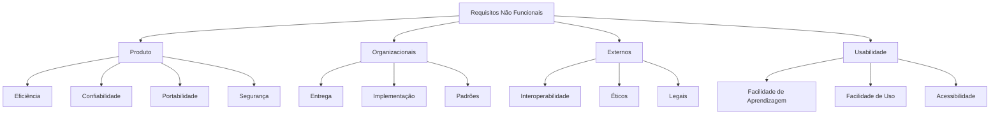

# 🧑‍💻 Requisitos de Software

Os <strong>requisitos de software</strong> são uma parte essencial da Engenharia de Software e da modelagem de sistemas. Eles definem as necessidades, funcionalidades, restrições e comportamentos que o sistema deve atender para satisfazer as expectativas dos usuários e clientes.

Os requisitos representam a documentação das condições, capacidades e especificações do software. Durante o desenvolvimento, eles devem ser levantados, esclarecidos, analisados, documentados, validados e revisados em conjunto com o cliente.

---

## Processo de Engenharia de Requisitos

O processo de engenharia de requisitos é composto por diversas etapas que garantem que o sistema atenda corretamente às necessidades do cliente.

### Estudo de Viabilidade

Analisa se o projeto é técnica, financeira e operacionalmente viável antes do início do desenvolvimento.

### Elicitação e Análise de Requisitos

Consiste em identificar, compreender e analisar as necessidades dos usuários por meio de entrevistas, reuniões, questionários e observações.

### Especificação de Requisitos

Os requisitos levantados são organizados e documentados de forma clara, completa e sem ambiguidades.

### Validação dos Requisitos

Verifica se os requisitos documentados representam corretamente as necessidades do cliente e se não apresentam inconsistências.

---

## Requisitos Funcionais

Os <strong>requisitos funcionais</strong> descrevem as funcionalidades que o sistema deve oferecer aos usuários. Eles representam os serviços, comportamentos e operações que o software deverá executar.

**Exemplos:**

* Realizar login de usuários.
* Cadastrar clientes.
* Emitir relatórios.
* Consultar pedidos.
* Atualizar informações cadastrais.
* Excluir registros.

---

## Requisitos Não Funcionais

Os <strong>requisitos não funcionais</strong> descrevem como o sistema deverá executar suas funcionalidades. Eles estabelecem restrições, padrões de qualidade e características relacionadas ao desempenho, segurança, infraestrutura e usabilidade.

---

## Classificação dos Requisitos Não Funcionais

### Requisitos de Produto

Definem características relacionadas ao próprio software.

**Exemplos:**

* Tempo de resposta.
* Desempenho.
* Confiabilidade.
* Segurança.
* Portabilidade.

#### Requisito de Eficiência

> O sistema deverá processar até **1.000 requisições por minuto**.

#### Requisito de Confiabilidade

> O sistema deverá permanecer disponível **99% do tempo**.

#### Requisito de Portabilidade

> O sistema deverá funcionar nos sistemas operacionais Windows, Linux e macOS.

---

### Requisitos Organizacionais

São restrições impostas pela organização responsável pelo desenvolvimento ou utilização do sistema.

**Exemplos:**

#### Requisitos de Entrega

> Relatórios de acompanhamento deverão ser entregues semanalmente.

#### Requisitos de Implementação

> O sistema deverá ser desenvolvido utilizando Java.

#### Requisitos de Padrão

> O desenvolvimento deverá seguir os princípios da Programação Orientada a Objetos (POO).

---

### Requisitos Externos

São requisitos definidos por fatores externos ao projeto, como legislação, integração com outros sistemas e normas regulatórias.

**Exemplos:**

#### Requisitos de Interoperabilidade

> O sistema deverá integrar-se ao SQL Server.

#### Requisitos Éticos

> O sistema não poderá expor informações privadas dos usuários.

#### Requisitos Legais

> O sistema deverá atender às exigências da LGPD e demais legislações aplicáveis.

---

### Requisitos de Usabilidade

Relacionam-se à facilidade de utilização do sistema pelos usuários finais.

**Exemplos:**

* O usuário deverá aprender a utilizar o sistema após um curto período de treinamento.
* As telas deverão possuir navegação intuitiva.
* As mensagens de erro deverão ser claras e objetivas.

---

## Comparação

| Requisitos Funcionais | Requisitos Não Funcionais |
|------------------------|---------------------------|
| Definem **o que** o sistema faz. | Definem **como** o sistema deve funcionar. |
| Representam funcionalidades. | Representam restrições e atributos de qualidade. |
| São percebidos diretamente pelos usuários. | Geralmente são percebidos durante a utilização do sistema. |

---

## Taxonomia dos Requisitos Não Funcionais

