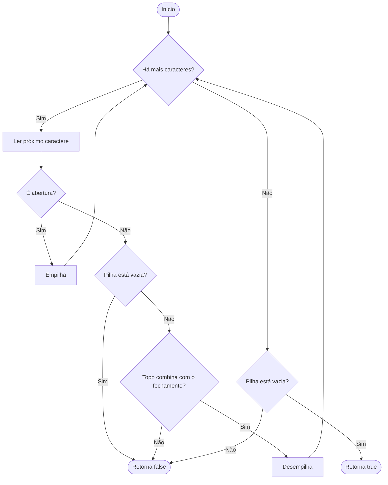

# 20. Valid Parentheses
<p align="justify">
Given a string s containing just the characters '(', ')', '{', '}', '[' and ']', determine if the input string is valid.
An input string is valid if:
<ul>
    <li>Open brackets must be closed by the same type of brackets.</li>
    <li>Open brackets must be closed in the correct order.</li>
    <li>Every close bracket has a corresponding open bracket of the same type.</li>
</ul>

```
Example 1:
Input: s = "()"
Output: true

Example 2:
Input: s = "()[]{}"
Output: true

Example 3:
Input: s = "(]"
Output: false

Example 4:
Input: s = "([])"
Output: true

Example 5:
Input: s = "([)]"
Output: false
```
</p>    

## Solução
### Pensamentos e Anotações
<p align="justify">


</p>    

### Resultado
```
var isValid = function(s) {
    const pilha = [];

    for (const c of s) {

        if (c === '(' || c === '[' || c === '{') {
            pilha.push(c);
        } else {

            if (pilha.length === 0) {
                return false;
            }

            const topo = pilha.pop();

            if (
                (c === ')' && topo !== '(') ||
                (c === ']' && topo !== '[') ||
                (c === '}' && topo !== '{')
            ) {
                return false;
            }
        }
    }

    return pilha.length === 0;
};
```