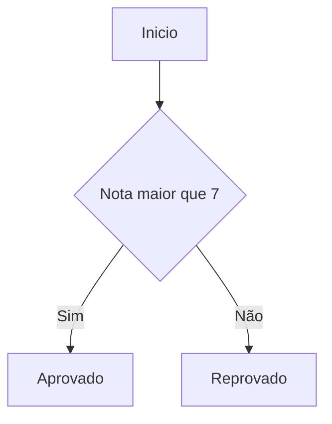
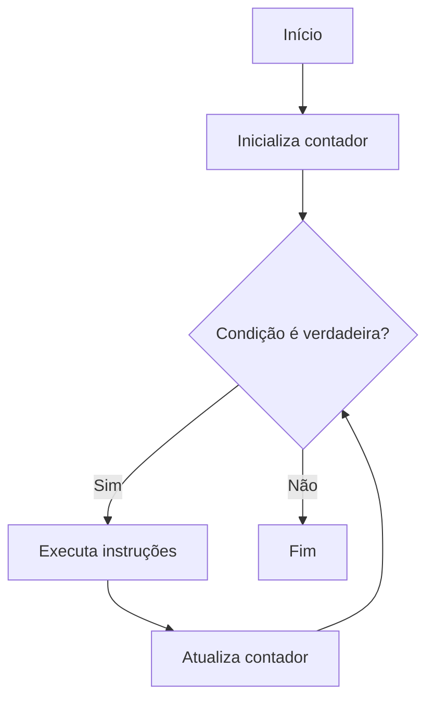

# 🧑‍💻 Lógica de Programação

A lógica de programação é a capacidade de organizar pensamento e instruções para resolver problemas através de algoritmos, não depende de uma linguagem especifica, mas da maneira que estruturamos pensamento humano para que um computador execute.

---

## Algoritmos e sequenciamento

Um <strong>algoritmo</strong> é uma sequência finita de passos lógicos e bem definidos para resolver um problema ou executar uma tarefa. O computador executa as <strong>instruções</strong>, que são as linhas de código,  a exatamente na ordem em que foram escritas, e isso é o <strong>sequenciamento</strong>. 

## Variavéis e tipos de dados

Para processar informações, o computador as guarda em memória. Uma <strong>variável</strong> é como uma caixa com nome onde voce armazena um valor que pode ou não mudar ao longo da execução do programa. Existem alguns <strong>tipos de dados</strong> que podem ser guardados, sendo os mais comuns:
<ul>
    <li>Inteiro (int): Números inteiros, positivos ou negativos</li>
    <li>Real/Flutuante (float/double): Números com pontos decimal</li>
    <li>Texto (string): Caracteres alfanuméricos, geralmente entre aspas</li>
    <li>Booleano (boolean): Valores logicos que so podem ser verdadeiros ou falso</li>
</ul>

## Estrutura de controle

Nem sempre um código vai rodar em linha reta. As estruturas de controle moldam o fluxo de execução baseados em condições ou repetições de código.

### Estruturas condicionais (decisão)

Permitem que o programa tome caminhos diferentes baseados em uma validação lógica. É o Se.. Então... Senão... <i>Exemplo: Se a nota for maior que 7, então ele está "Aprovado". Senão, ele está "Reprovado"</i>. 

### Estruturas de repetição (Laços/Loops)

Servem para executar o mesmo bloco de código varias vezes, evitando reescrever as mesmas linhas.
<ul>
    <li>Enquanto (While): Repete um bloco enquanto uma condição for verdadeira. <i>Exemplo: Enquanto a bateria for menor que 100%, continue carregando.</i></li>
    <li>Para (For): Repete um bloco de código por um número definido de vezes. <i>Exemplo: Repita 10 vezes a ação de correr 1km</i></li>
</ul>

### Operadores

Operadores são utilizados para construir as condições e manipular variavies. Existem três tipos de operadores: Aritméticos, Relacionais e Lógicos.

| Aritméticos | Significado | Relacionais | Significado | Lógicos | Significado |
|-------------|-------------|--------------|-------------|---------|-------------|
| +           | Soma        | ==           | Igual       | &&      | E           |
| -           | Subtração   | !=           | Diferente   |    \|\|   | OU          |
| *           | Multiplicação| >           | Maior       | !       | NÃO         |
| /           | Divisão     | <            | Menor       |         |             |
| %           | Módulo      | >=           | Maior igual |         |             |
| ++          | Incremento  | <=           | Menor igual |         |             |

